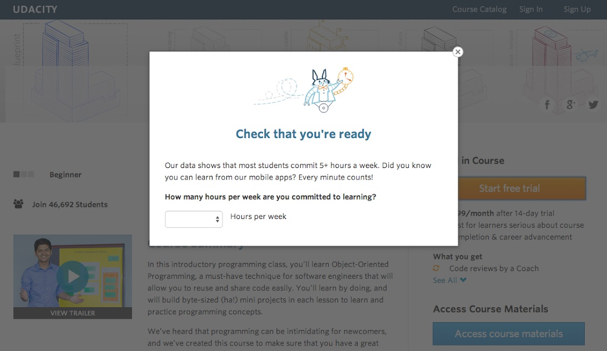
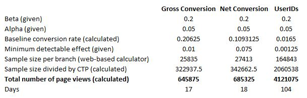

# P7: Design an A/B Test

--------

## Experiment Design

Udacity courses currently have two options on the home page: "start free trial", and "access course  materials".

If the student clicks "start free trial", they will be asked to enter their credit card information, and then they will be enrolled in a free trial for the paid version of the course. After 14 days, they will automatically be charged unless they cancel.

If the student clicks "access course materials", they will be able to view the videos and take the quizzes for free, but they will not receive coaching support or a verified certificate, and they will not submit their final project for feedback.

In the experiment, Udacity tested a change where if the student clicked "start free trial", they were asked how much time they had available to devote to the course. If the student indicated 5 or more hours per week, they would be taken through the checkout process as usual. If they indicated fewer than 5 hours per week, a message would appear indicating that Udacity courses usually require a greater time commitment for successful completion, and suggesting that the student might like to access the course materials for free. At this point, the student would have the option to continue enrolling in the free trial, or access the course materials for free instead.

<end>

The hypothesis was that this might set clearer expectations for students upfront, thus reducing the number of frustrated students who left the free trial because they didn't have enough time—without significantly reducing the number of students to continue past the free trial and eventually complete the course. If this hypothesis held true, Udacity could improve the overall student experience and improve coaches' capacity to support students who are likely to complete the course.

### Metric Choice

The list below explains the use of each available metric as an invariant or evaluation metric.

(1) Number of cookies: That is, number of unique cookies to view the course overview page (dmin=3000)
**Invariant metric: YES** - it is used as initial unit of diversion to make sure that we split equally between control and experiment group 
**Evaluation metric: NO** - invariant metric should not change between tests (control, experiment)

(2) Number of userids: That is, number of users who enroll in the free trial (dmin=50)
**Invariant metric: NO** - this metric can not be used for diversion 
**Evaluation metric: NO** - the number depends on whether the students enrolls into the "start free-trail" or not. Only there we would get the userids

(3) Number of clicks: That is, number of unique cookies to click the "Start free trial" button (which happens before the free trial screener is trigger) (dmin=240)
**Invariant metric: YES** - check that the same amount of users proceed from course page to the experiment page under controlled and experiment conditions 
**Evaluation metric: NO** - invariant metric should not change between tests (control, experiment)

(4) Click-through-probability: That is, number of unique cookies to click the "Start free trial" button divided by number of unique cookies to view the course overview page (dmin=0.01)
**Invariant metric: YES** - make sure the population of students is similar in both groups 
**Evaluation metric: NO** - invariant metric should not change between tests (control, experiment)

(5) Gross conversion: That is, number of userids to complete checkout and enroll in the free trial divided by number of unique cookies to click the "Start free trial" button (dmin= 0.01)
**Invariant metric: NO** - evaluation metric 
**Evaluation metric: YES** - the experiment might change this metric, since depending on their time availability they will be opted to a free version

(6) Retention: That is, number of userids to remain enrolled past the 14 day boundary (and thus make at least one payment) divided by number of userids to complete checkout (dmin=0.01)
**Invariant metric: NO** - not a good fit for invariant, depending on the experiment it could be used as evaluation metric 
**Evaluation metric: NO** - this metric is not relevant to test our hypothesis

(7) Net conversion: That is, number of userids to remain enrolled past the 14 day boundary (and thus make at least one payment) divided by the number of unique cookies to click the "Start free trial"
button (dmin= 0.0075)
**Invariant metric: NO** - evaluation metric 
**Evaluation metric: YES** - the experiment might change this metric, since depending on their time availability the will be opted to a free version

### Measuring Standard Deviation

I used the baseline values to analytically estimate the standard deviation (SD) of the 2 selected evaluation metrics (Gross conversion; Net conversion). Assuming a binomial distribution, SD = sqrt((p*(1-p)/N).

**Gross conversion:** N=400; p=0.2063; **SD=0.0202**

**Net conversion:** N=400; p=0.1093; **SD=0.0156**

A binomial distribution follows a normal distribution for large sample sizes. Both metrics (Gross- and Net conversion) depend on a number of unique cookies that click "start free trial" button, which is in line with our unit of diversion. This should lead to the assumption that the analytic estimate should be comparable to the empirical variability.

### Sizing
a) Number of Samples vs. Power (see "ProjectBaselineValues.xlsx" for detailed calculation)

Based on Beta, Alpha, Baseline conversion and minimum detectable effect I used a web calculator tool to calculate the sample size per branch (Tool used - [http://www.evanmiller.org/ab-testing/sample-size.html
](http://www.evanmiller.org/ab-testing/sample-size.html)

<end>

To achieve sufficient power for both evaluation metrics we require a total number of page view of 685325. Bonferroni correction is not used since both evaluation metrics have to be valid and Bonferroni correction is "over" conservative for high correlation metrics.

b) Duration vs. Exposure
Based on the KPI "Unique cookies a day" = 40000 the experiment has to run 18 days. 

I do not consider the experiment as very risky for Udacity. At the end a part of the students get only an additional "self-assessment" question. The question itself is not ethically problematic. I do not assume that this experiment has an effect on the overall experience or functionality of the Udacity web-site. I would therefore divert all of the traffic to this experiment

### Experiment Analysis
###Sanity Checks

One of the first things to do once you finish collecting experimental data is to analyze the invariant metrics. I want to check if the experiment and control conditions are comparable. To achieve this we compare the numbers of "cookies" and "clicks" on the start free trail button across the experiment and control condition. Our assumption is that the split is 50%. Assuming a binomial distribution and a 95% confidence interval for the invariant metrics the below list shows the calculated results (for details see R-Studio file - "P7_AB_testing.Rmd")

Number of cookies: **Passed** - lower bound = 0.4988 / upper bound = 0.5012 / observed = 0.5006

Number of clicks on "Start free trail": **Passed** - lower bound = 0.4959 / upper bound = 0.5041 / observed = 0.5005

For both invariant metrics we are within the 95% confidence interval and hence we passed the sanity check.

### Result Analysis
a) Effect Size Tests

(for details see R-Studio file - "P7_AB_testing.Rmd")
The effective Size Test was calculated for the evaluation metrics (Gross- and Net conversion). Below the results for the confidence interval 95%.

**Gross conversion:** Statistical significant - **YES** / Practical significant - **YES** / lower bound - (-)0.0291 / upper bound - (-)0.0120

**Nets conversion:** Statistical significant - **NO** / Practical significant - **NO** / lower bound - (-)0.0116 / upper bound - 0.0019

The gross conversion is statistical significant (does not include the zero value) and practical significant >0.01
The net conversion is not statistical significant (does include the zero value) and not practical significant <0.0075

b) Sign Tests
To calculate the results for the Sign Test I used an online calculator for "Sign and binomial test" (http://graphpad.com/quickcalcs/binomial1.cfm). The results are as follows:

Gross conversion - Statistical significant - **YES**: #days = 23 / #days experiment > control = 4 / baseline p = 0.50 / 2-tailed P-value = 0.0026

Net conversion - Statistical significant - **NO**: #days = 23 / #days experiment > control = 10 / baseline p = 0.50 / 2-tailed P-value = 0.6776

For Gross conversion the 2-tailed P value = 0.0026 (This is the chance of observing either 4 or fewer successes, or 19 or more successes, in 23 trials) is statistical significant (<0.05). In net conversion there was no significant difference

c) Summary
The results of both tests (Effect Size and Sign Tests) agree with each other. As expected the gross conversion was lower in the experiment condition than in the controlled condition. However the net conversion decreased too, but not statistical significant. Considering the practical significant for net conversion, which is within the confidence interval, there might be a big enough impact on the business caused by the decrease of net conversion through the additional "pop-up" question.

I did not use Bonferroni correction because both evaluation metrics need to be valid, valid means - gross conversion should decrease significantly, but at the same time net conversion should not decrease significantly. Bonferroni correction in this case would be too conservative.
 
### Recommendation
Looking at our hypothesis from the beginning of this document we can conclude that the "time assessment" questionnaire decreases gross conversion by a practically significant amount. The net conversion decreases too but not by a statistically significant amount. This leads to the assumption that students make better informed decision based on the experiment condition. We can not exclude the risk that the questionnaire in the experiment condition turns away students who would have continued the free trial after the trail period.

This leads to a summary of mixed results. We can be confident that we increase the student experience through the experiment condition but we can not exclude that there is a negative impact on net conversion and hence on company revenue. My recommendation is that people in charge of student experience and P&L sit together and decide on the priorities. If the agreement is on student experience the experiment set-up should be launched.

## Follow-Up Experiment
The follow up experiment should focus on "Retention" (number of userids to remain enrolled past the 14 day boundary (and thus make at least one payment) divided by number of userids to complete checkout). I propose a kind of gamification approach. The purpose of the "gamification board" would be to give students continues update on how much time they have spend on the course vs plan (5 hours), and motivational triggers to keep going. Motivational trigger can be - depending on the amount of hours spent you increase your status (bronze, silver, gold,..), could be peer comparisons, weekly achievements and rewards,...

In an experiment the display of such a gamification board could be tested. The experiment group would see a gamification board in the browser and the control group not. The hypothesis is that the display of a gamification board would decrease frustration and "since students are human" help to overcome phases of low motivation through motivators. 

Unit of diversion for this experiment would be userids, since we divert them after they have signed up and given their credit card information. Invariant metric would be number of userids enrolling into the free trial. The evaluation metric would be the retention rate. If significantly more students stay enrolled after the 14 days free trail we can be confident that the gamification board keeps student engaged.

--------

Resources - list any sources you consulted to create your visualization:

- https://github.com/jsalminen/AB-testing
- https://rpubs.com/superseer/abtesting
- https://github.com/j450h1/P7-Design-an-A-B-Test
- http://www.evanmiller.org/ab-testing/sample-size.html
- http://graphpad.com/quickcalcs/binomial1.cfm

 
